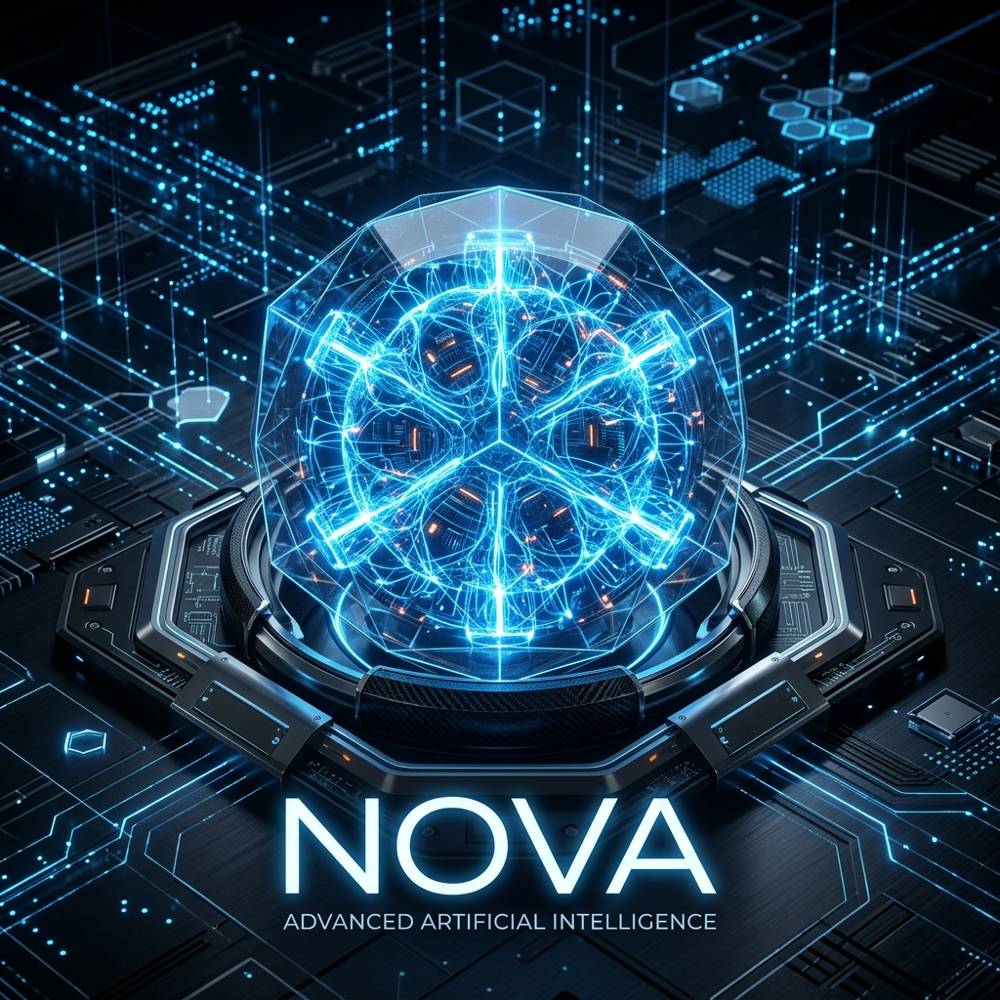

<div align="center">
  
  <br/><br/>
  <h1>🌟 NOVA - Advanced Local AI Desktop Assistant</h1>
  <p>An intelligent, highly capable, and localized AI desktop assistant built to seamlessly manage your digital life, control your system, and understand complex commands via voice and text.</p>

  
  
  
  
</div>

## 🧠 About NOVA
NOVA is a proactive, context-aware artificial intelligence designed to run directly on your desktop environment. Unlike simple chatbots, NOVA features an interconnected brain capable of executing system commands, analyzing documents, navigating the web autonomously, and retaining conversational context over long periods. 

It heavily relies on free-tier LLM providers through APIs and advanced caching capabilities to offer deep intelligence without high subscription costs.

## ✨ Features and Abiltites (Skills)

NOVA possesses an extensive architecture of modules known as **Skills**. Here is what NOVA can do for you:

### ⚙️ System & Productivity
- **System Control** (`system.py`): Complete control over your OS operations, volume, brightness, battery checking, media controls.
- **Reminders & Calendar** (`reminders.py`, `calendar_skill.py`): Intelligent scheduling and reminders.
- **Document Analysis & Writing** (`document_analysis.py`, `document_writer.py`): Extract, summarize, and generate professional documents (PDFs, Word).
- **Code Architect & Codebase Reader** (`code_architect.py`, `codebase_reader.py`): Assist with local software development and codebase explanations.

### 🌐 Web & Media
- **Browser Agent & Control** (`browser_agent.py`, `browser_control.py`): Unrestricted autonomous web browsing and control.
- **Search & Info** (`search.py`, `info.py`, `knowledge_expansion.py`): Deep dive into DuckDuckGo/Wikipedia to fetch highly accurate answers.
- **Media & Music & Downloader** (`media.py`, `music.py`, `downloader.py`): Complete music streaming and video download orchestration.

### 💬 Communication & Automation
- **WhatsApp Calls & Messenger** (`whatsapp_call.py`, `messenger.py`): Fully automated messaging and VOIP calls.
- **Email Service** (`email_service.py`): Draft, parse, and send emails effortlessly.
- **Phone & Automation** (`phone.py`, `automation.py`): Interface with your phone connectivity and UI automations.

### 🤖 Cognition & AI
- **Vision Manager** (`vision.py`, `vision_skill.py`): "See" your screen or uploaded images to understand context via OCR.
- **Emotion & Natural Events** (`emotion_analytics.py`, `natural_events.py`): Detect emotions to reply appropriately and naturally.
- **Training & CAR Workflow** (`training.py`, `online_training.py`, `car_workflow.py`): Nova grows with you actively via Copy-Analyze-Rebuild integrations.
- **Math & Finance** (`math_skill.py`, `finance.py`): Manage budgets and execute complex calculations.

---

## 🚀 Installation & Getting Started

1. **Clone the repository**
```bash
git clone https://github.com/your-username/NOVA.git
cd NOVA
```

2. **Install Dependencies**
Ensure you have Python 3.10+ installed.
```bash
pip install -r requirements.txt
playwright install
```

3. **Configure API Keys**
Rename `keys.example.json` within the `userdata/` folder (or create it) to `keys.json` and insert your respective LLM API Keys (Gemini, OpenRouter, Groq, etc).
>  **⚠️ CRITICAL: NEVER commit your `keys.json` or `.env` files to GitHub! They are ignored in the `.gitignore` by default.**

4. **Run NOVA**
```bash
python desktop.py
```

## 📂 Project Structure

- `/core/` - The foundational AGI-like architecture (memory, LLM managing, vision, NLU, etc.)
- `/skills/` - The modular actionable abilities defining what NOVA can explicitly do.
- `/tools/` - Standalone tools for CLI interactions (knowledge injection, model training).
- `/scripts/` - Scripts for datasets and automated learning ingestion.
- `/userdata/` - **Exempt from version control.** Contains your local logs, user profiles, API keys, and models.

## 🤝 Contributing

**Contributions are highly welcome!** 
Whether it involves squashing a bug, adding a new skill to `skills/`, or refining the core reasoning engine, your input helps make NOVA truly extraordinary. 

1. Fork the Project.
2. Create your Feature Branch (`git checkout -b feature/AmazingSkill`).
3. Commit your Changes (`git commit -m 'Add some AmazingSkill'`).
4. Push to the Branch (`git push origin feature/AmazingSkill`).
5. Open a Pull Request.

*If you don't know where to start, feel free to check the active issues or submit a question!*

## 📜 License

Distributed under the MIT License. See `LICENSE` for more information.

---
<div align="center">
  <i>"A companion designed to run everywhere, and optimize everything."</i>
</div>
