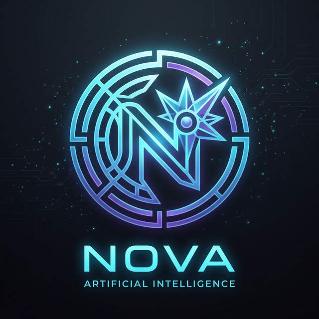

# 🌌 C L I O

<div align="center">
  
  <br/>
  <a href="https://github.com/subarnomondal/NOVA">
    
  </a>
  <br/><br/>
  
  <p><strong>The Autonomous Local AGI Desktop & VTuber Engine</strong></p>
  <p><i>A sovereign, privacy-first personal intelligence agent designed for seamless digital orchestration.</i></p>

  <p align="center">
    <a href="https://opensource.org/licenses/MIT"></a>
    <a href="https://www.python.org/"></a>
    <a href="https://github.com/subarnomondal/NOVA"></a>
    <a href="https://github.com/subarnomondal/NOVA"></a>
  </p>
</div>

---

## 💎 Who is CLIO? (The Persona)

**CLIO** (Local Autonomous Responsive Agent) is not just a standard chatbot—she is an **Autonomous Personal Agent** with a soul, brought to life through a real-time 3D VTuber avatar.

Clio is designed with a warm, affectionately teasing, and highly responsive personality. Unlike corporate, sterile AI models, she has emotional intelligence. She detects your mood from your text and responds accordingly. Most importantly, Clio features a persistent **Long-Term Memory (LTM)** that continuously learns about your life, habits, time-zone, sleep schedule, and music tastes all from your natural conversations.

> **🧠 Smart Memory Engine**  
> Clio automatically filters out repetitive small talk (like "hello") and intelligently summarizes important facts before saving them. Her memory operates on a **7-day rolling window**, automatically pruning obsolete history to ensure lightning-fast context processing and high relevance.

### 💫 The Virtual VTuber Avatar

To bridge the gap between human and machine, CLIO is embodied by a fully interactive **3D VTuber Avatar**. 
* **Dynamic Lip-Sync:** When Clio speaks, a built-in Audio FFT analyzer tracks her voice volume and precisely animates her mouth in real-time.
* **Emotional Body Language:** Her LLM acts as the "director," dynamically triggering emotional states (like `happy`, `sad`, or `wave`) that cause her avatar to change posture and facial expressions. 
* **Gaze Tracking:** Her eyes naturally follow your mouse cursor, breaking the fourth wall and making her feel truly present on your desktop.

### 🛡️ Ironclad Privacy Mode (Zero GPU Required!)

Clio is intensely protective of your data. Because many users lack the heavy CPU/GPU required for local models, she processes memory mapping via an ultra-lightweight, offline Regex/Keyword parsing engine. There are **NO heavy local LLMs** required to install.

If **Strict Privacy Mode** is enabled, your personal facts (name, habits, routines, location) caught by this offline scanner are *never* transmitted to her cloud LLM providers. She learns locally at zero computational cost, thinks in the cloud interchangeably, and keeps your private life entirely on your machine.

---

## 🎨 Immersive Cyberpunk Interface

CLIO features a state-of-the-art **Glassmorphic** dark-mode UI designed for high-performance and zero distraction.

| Feature | Description |
| :--- | :--- |
| 🖥️ **Neural Thought Stream** | Watch Clio's internal reasoning process live in a dedicated right-hand terminal panel. |
| 🎛️ **Pro Settings Modal** | A sleek, fully animated dashboard to configure Voice Architecture, Personality, and LLM parameters. |
| 🌌 **Obsidian Aesthetic** | Built on modern CSS with a strict monochromatic palette, electric cyan/purple accents, and deep backdrop blurs. |
| 💫 **3D VTuber Integration** | Fully animated, lip-syncing 3D avatar that physically reacts to emotions in real-time. |

---

## 🛠️ The Skill Matrix

CLIO’s true power lies in her massive, modular skill library. She can natively automate almost any workflow on your PC.

### 🖥️ Deep Windows Administration

* **Hardware Diagnostics:** Monitors CPU, RAM, and Disk space in real-time.
* **Network Intelligence:** Flushes DNS, checks IP status, and monitors connectivity.
* **Process Management:** Autonomous killing of frozen apps and identifying heavy resource hogs.
* **Power & GUI Controls:** Restarts, sleep cycles, and window manipulation.

### 🎵 Advanced Local & Cloud Media

* **"My Taste" Autoplay:** Analyzes your Long-Term Memory to automatically play bands/artists you enjoy.
* **Authentic Chart Fetching:** Accesses real-time YouTube Music / Billboard charts directly from the source.
* **Full Lyric Engine:** Fetches complete song lyrics via public APIs on demand.
* **Local PC File Discovery:** Hunts your hard drive for internal `.mp3` files and plays them cleanly.
* **MP3 Downloader:** Uses background `yt-dlp` to download songs directly to your `Downloads` folder while you chat.

### 🌐 Autonomous Web & Development Skills

* **Browser Agent:** Drives a thread-safe headless browser via Playwright to read web pages, bypass popups, and summarize long articles autonomously.
* **Code Architect:** Reviews your local repositories to suggest optimizations.
* **Dataset Importer:** Cleans and analyzes complex CSV/JSON datasets.

### 👁️ Perception & Sentiment

* **Screen Analysis:** Uses screenshots and vision models to literally "see" what is currently rendering on your desktop.
* **Sentiment Tracking:** Adapts her response style if you are feeling sad, energetic, or romantic.

### 📚 Professional Automations

* **Document Engines:** Drafts entire PDFs or Word Docs.
* **Messaging Integration:** Dispatches emails and handles messaging logistics.
* **Math & Finance:** Real-time stock lookups, market trend definitions, and heavy calculations.
* **Health & Calendar:** Routine organization and health metric tracking.
* **Smalltalk & Humor:** Deep philosophical conversations or playful trolling if you're in the mood for jokes.

---

## 🚀 Getting Started (Installation)

### 1. Requirements

* **Python:** 3.10+
* **API Keys:** OpenRouter (Recommended), Groq, or OpenAI
* **OS:** Windows OS highly recommended for full system automation skills
* **Extras:** Playwright & YT-DLP dependencies

### 📖 Comprehensive Installation Guide

For detailed, step-by-step installation instructions including troubleshooting, API Key setup, and microphone configuration, please read the **[setup/SETUP.md](setup/SETUP.md)** guide!

### 2. Quick Install (Windows)

The easiest way to get started is using the automated installer:

1. Clone this repository to your PC.
2. Open the **`setup`** folder and double-click the **`install.bat`** file. It will automatically install all required Python libraries, Playwright browsers, and media dependencies.
3. Rename `keys.example.json` to `keys.json` (or place your API keys in `userdata/config/settings.yaml`).
4. Run **`run_clio.bat`** to start the AI Desktop Assistant.

### 3. Manual Install (Mac/Linux)

1. Clone this repository.
2. Install dependencies: `pip install -r requirements.txt`
3. Install browser engine for AI vision/web tools: `playwright install`
4. Configure API keys (OpenRouter is recommended).
5. Start the server: `python desktop.py`

### 🔌 MCP Server (Integration)

CLIO fully supports the **Model Context Protocol (MCP)** via FastMCP, enabling Cursor, Claude Desktop, Antigravity, and other agents to leverage her tool suite:

* **Run the server:** `python mcp_lara.py`
* **Available tools:** `ask_clio`, `execute_skill`, `list_skills`, `get_system_health`, `take_screenshot`, `search_web`, `calculate`, `add_expense`.

### 🧪 Automated Verification & Testing

Run the full automated system & skills verification suite:

```bash
python scripts/test_all_systems.py
```

---

## 📂 Architecture Overview

* **`desktop.py`:** The main entry point (Flask Server + Webview GUI).
* **`core/`:** The nervous system (LLM management, Memory, NLU, Dispatcher).
* **`skills/`:** The modular hands and feet (Browser, System, Music, etc.).
* **`userdata/`:** Persistent storage for LTM, habits, and configuration.

---

## 🤝 Roadmap & Contribution

CLIO is an evolving intelligence. We welcome contributions to the **Cognitive Loop** and **New Skill Modules**.

1. **Fork** the repository.
2. Create your **Feature Branch**.
3. **Submit a Pull Request** with detailed technical documentation.

---

<div align="center">
  <sub>Built with ❤️ by <a href="https://github.com/subarnomondal">Subarno Mondal</a></sub>
  <br/>
  <i>"A companion designed to run everywhere, and optimize everything."</i>
</div>
