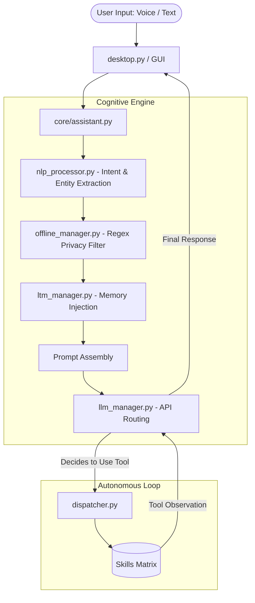
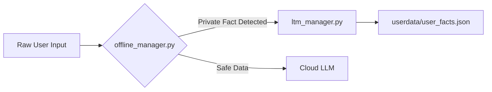

# CLIO / NOVA - Autonomous Local AGI Desktop Architecture 🌌

## 1. System Overview & Philosophy

CLIO (Cognitive Local Intelligence Orchestrator) is a sovereign, privacy-first personal assistant. Unlike standard chatbots, CLIO operates as an **Autonomous Agent** directly integrated into the user's OS.
It features a hybrid architecture combining **fast local heuristics (NLU)** with **powerful Cloud LLM reasoning**, ensuring that private facts are filtered locally while complex reasoning is offloaded efficiently.

---

## 2. High-Level Architecture Flow

---

## 3. Core Engine Deep Dive (`core/`)

The `core/` directory is the nervous system of CLIO.

### 3.1 Entry Points & Server

- **`desktop.py`**: The main execution script. It boots a local Flask server to handle backend API routes and launches a PyWebView window for the cyberpunk GUI. It manages parallel thread executors for non-blocking LLM calls and handles global error logging.
- **`telegram_bot.py`**: An alternative headless entry point allowing remote interaction via Telegram.
- **`mcp_lara.py`**: Model Context Protocol (MCP) server integration, exposing CLIO's internal tools to third-party agents like Claude or Cursor.

### 3.2 Input Processing & Routing (`assistant.py` & `nlp_processor.py`)

1. **NLU Classification**: `nlp_processor.py` analyzes incoming text to tag intents.
2. **Dual-Path Routing**:
   - **Fast Social Path**: If the user is just saying "Hello" or engaging in small talk, CLIO skips the complex agent loop and does a single-shot fast LLM generation.
   - **Autonomous ReAct Loop**: If a task is detected, CLIO enters a "Reasoning and Acting" loop (max 5 iterations). It injects available tool tags (`[SKILL]`, `[CMD]`) into the system prompt and waits for the LLM to output a command, captures the observation, and loops until the task is complete.

### 3.3 The Dispatcher & Dynamic Loading (`dispatcher.py`)

- **Eager Loading**: Foundational skills are loaded into memory instantly on startup.
- **Lazy Discovery**: To keep memory footprint low and startup instant, `dispatcher.py` uses a `ThreadPoolExecutor` to scan the `skills/` folder concurrently, extracting regex triggers (e.g., `dispatcher.register(...)`). The actual Python module is only imported when the specific skill is invoked by the LLM.

### 3.4 LLM Management (`llm_manager.py`)

- Manages connections to external LLM providers (defaulting to free-tier OpenRouter models like Nemotron and Gemma).
- Injects dynamic system prompts, handles fallback providers, and parses JSON/Tool-call outputs to map them back to the `dispatcher`.

---

## 4. Memory & Privacy Architecture

CLIO features a unique localized memory structure designed to prevent cloud leakage of personal data.

- **`offline_manager.py` (Strict Privacy Mode)**: Uses lightweight regex and local heuristics to intercept names, locations, sleep schedules, and passwords *before* the text ever hits a cloud API.
- **`ltm_manager.py` (Long-Term Memory)**: A JSON-backed memory system. Facts are stored with timestamp and reinforcement metrics.
  - **Memory Decay**: Facts have a 60-day decay threshold. If a fact isn't reinforced in conversation for 60 days, it is organically "forgotten" to keep the context window clean.
- **`conversation_memory.py`**: Short-term sliding window (typically last 5-10 exchanges) to provide immediate conversational context.

---

## 5. The Skills Matrix (`skills/`)

The `skills/` directory contains all actionable plugins. CLIO can execute these dynamically.

### 🌐 Web & Browser Automation

- **`browser_agent.py` / `browser_control.py`**: Operates a headless Playwright instance. CLIO can autonomously navigate dynamic sites, click buttons, bypass popups, and extract DOM text.
- **`search.py` / `info.py` / `downloader.py`**: Executes DuckDuckGo/Google searches and runs background `yt-dlp` tasks to download videos or MP3s directly to the user's hard drive.

### 🎵 Media & UI Control

- **`music.py` / `media.py`**: Interacts with local MP3s or fetches live Billboard/YouTube charts. Integrates with the LTM to "Autoplay" music based on user tastes.
- **`animation.py`**: Triggers specific visual states in the GUI.

### 💻 System & Code Architecture

- **`windows_cmd.py` / `system.py` / `automation.py`**: Native OS integrations. Can check CPU/RAM health, flush DNS, kill frozen apps, manage power states, or run arbitrary PowerShell strings.
- **`code_architect.py` / `codebase_reader.py`**: Analyzes local git repositories, reviews code structures, and suggests architectural optimizations.

### 👁️ Perception & Multimodality

- **`vision.py` / `vision_skill.py` / `proactive_vision.py`**: Uses Vision-Language Models to capture and analyze screenshots of the user's current desktop, allowing CLIO to debug visual UI errors or "see" what the user is looking at.
- **`emotion_analytics.py`**: Analyzes text sentiment to map internal emotional states (e.g., triggering `[EMOTION: happy]` to change the 3D avatar).

### 📈 Productivity & Data

- **`document_writer.py` / `document_analysis.py`**: Drafts, reads, and summarizes PDFs and Word Documents.
- **`math_skill.py` / `finance.py`**: Calculates complex equations and fetches live market/stock data.
- **`dataset_importer.py`**: Cleans and analyzes raw CSV/JSON files autonomously.
- **`calendar_skill.py` / `reminders.py` / `health.py`**: Manages cron-jobs for alarms and tracks health metrics in the LTM.

### 🧠 Agent Learning & Evolution

- **`skill_creator.py` / `training.py`**: The self-evolution module. CLIO can take a completed workflow, write a new Python script for it, and dynamically register it as a new skill without a reboot.
- **Specialized Agents**: `edu_agent.py`, `science_skill.py`, `car_workflow.py`.

---

## 6. Build System & Compilation

CLIO is meant to be portable. The end-user does not need Python installed to run the production build.

- **`build.py`**: The build orchestrator. It verifies `pyinstaller` is installed, maps the asset directories, and executes a cross-platform compilation command.
- **`LARA.spec`**: The specific configuration for PyInstaller. It dictates that:
  - The `web/`, `skills/`, and `core/` directories must be statically bundled.
  - Excludes bloated external binaries where unnecessary.
  - Generates a `--windowed` (no terminal) executable.

**Portability (`userdata/`)**:
The compiled `CLIO.exe` stores all changing states—like API keys, user settings, LTM facts, downloaded files, and logs—inside the `userdata/` folder, which is generated dynamically on first boot. This ensures the executable remains immutable while all user-data is isolated and easy to back up.
